# Sequence Diagrams - Smart AI Chat System

Tai lieu nay tong hop so do tuan tu cho cac chuc nang chinh cua he thong (REST + Socket realtime).

## 1. Dang ky voi OTP

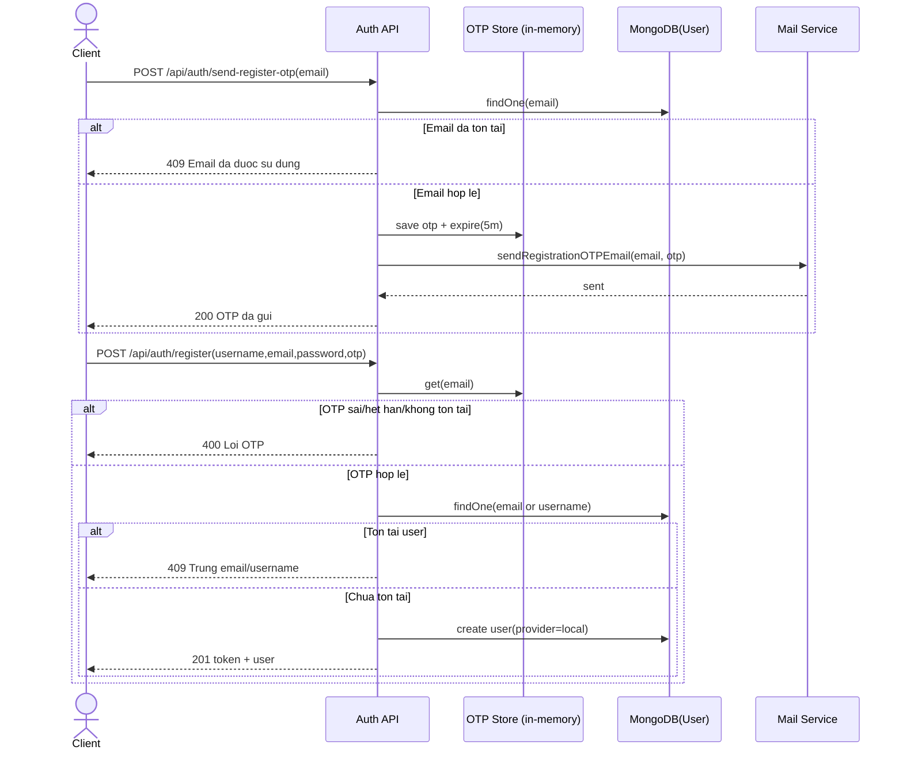

## 2. Dang nhap (Local + Google)

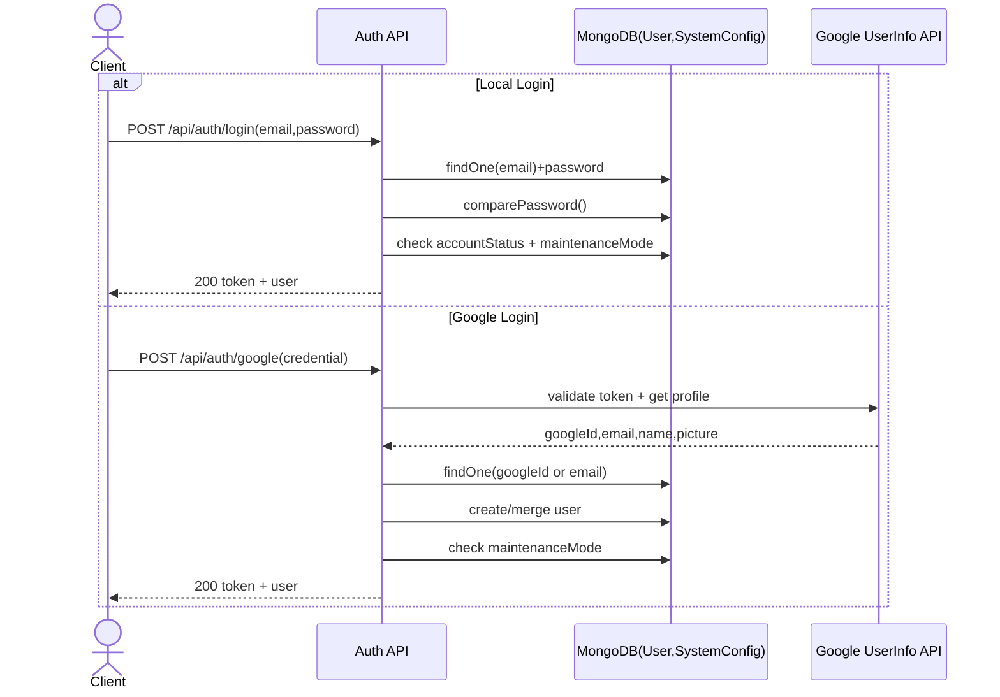

## 3. Quen mat khau (OTP)

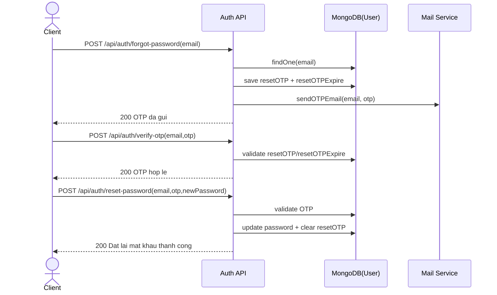

## 4. Cap nhat profile user

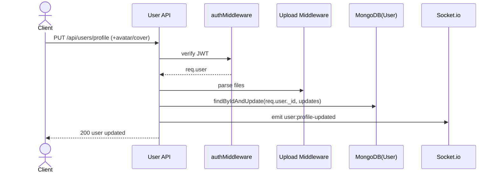

## 5. Quan ly ban be (gui, chap nhan, huy)

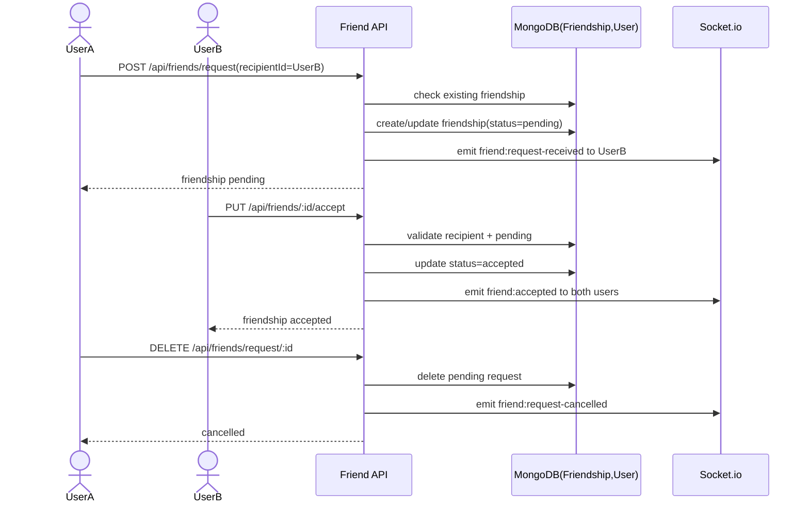

## 6. Tao room va quan ly thanh vien

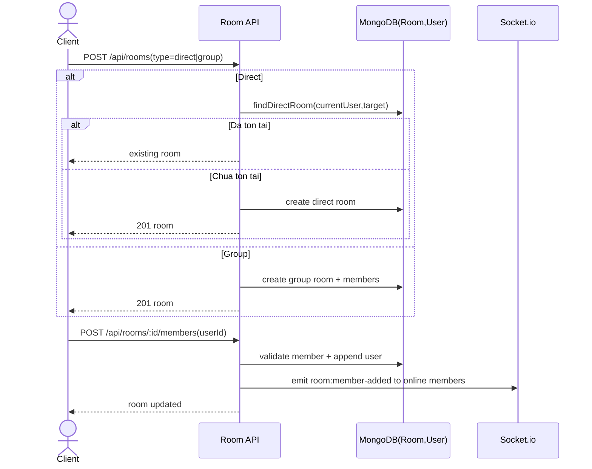

## 7. Nhan tin realtime (Socket)

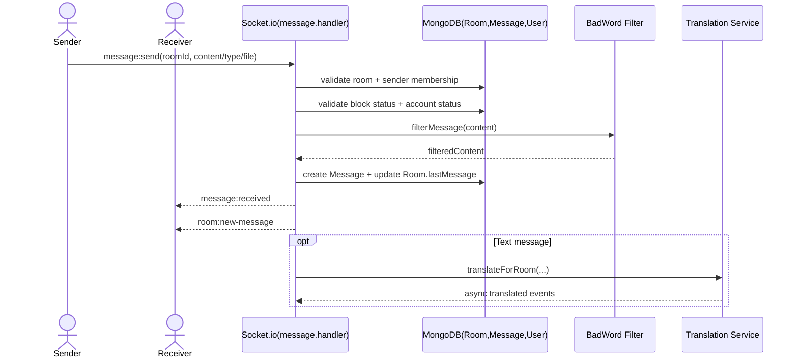

## 8. Trang thai tin nhan (da doc, react, xoa)

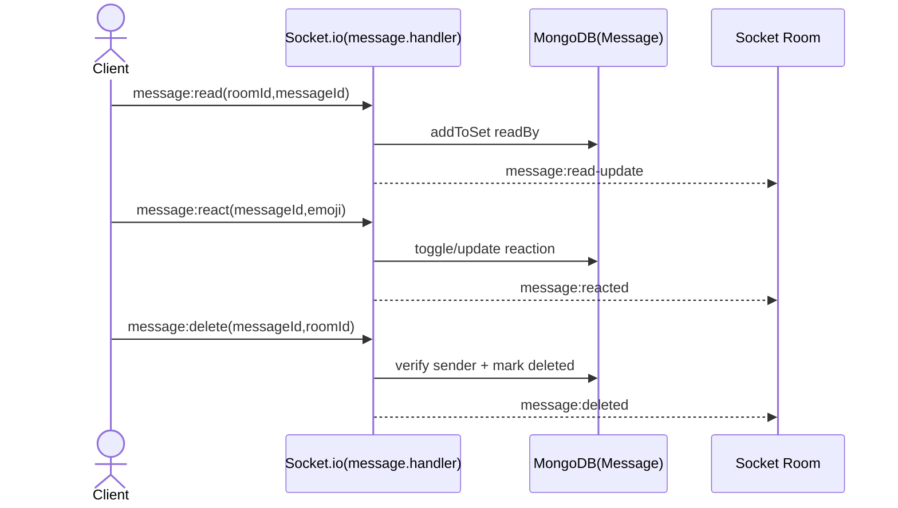

## 9. Notes va reply note thanh tin nhan

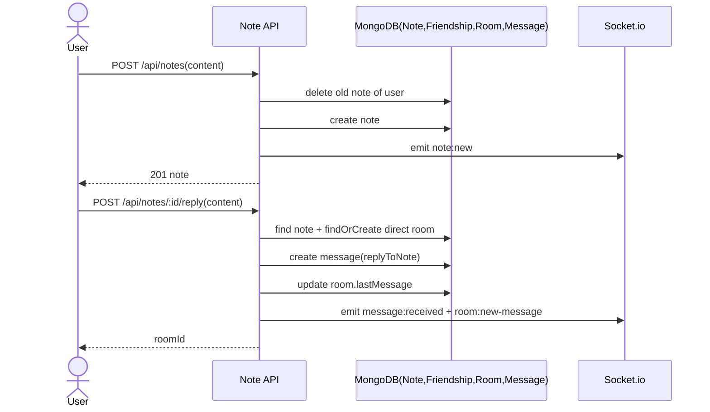

## 10. Upload file

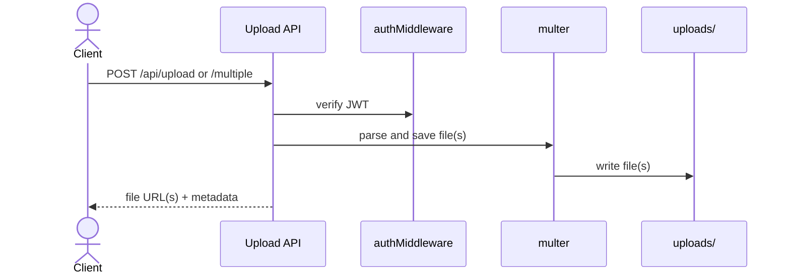

## 11. User actions (block, unblock, report)

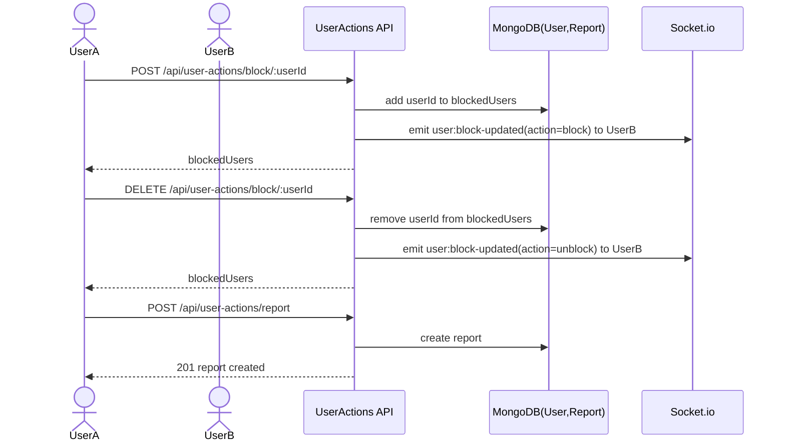

## 12. Quan tri he thong (Admin)

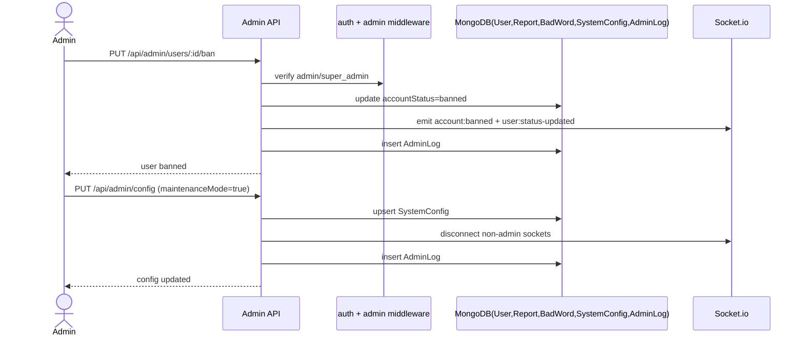

## 13. Goi video/thoai + WebRTC signaling

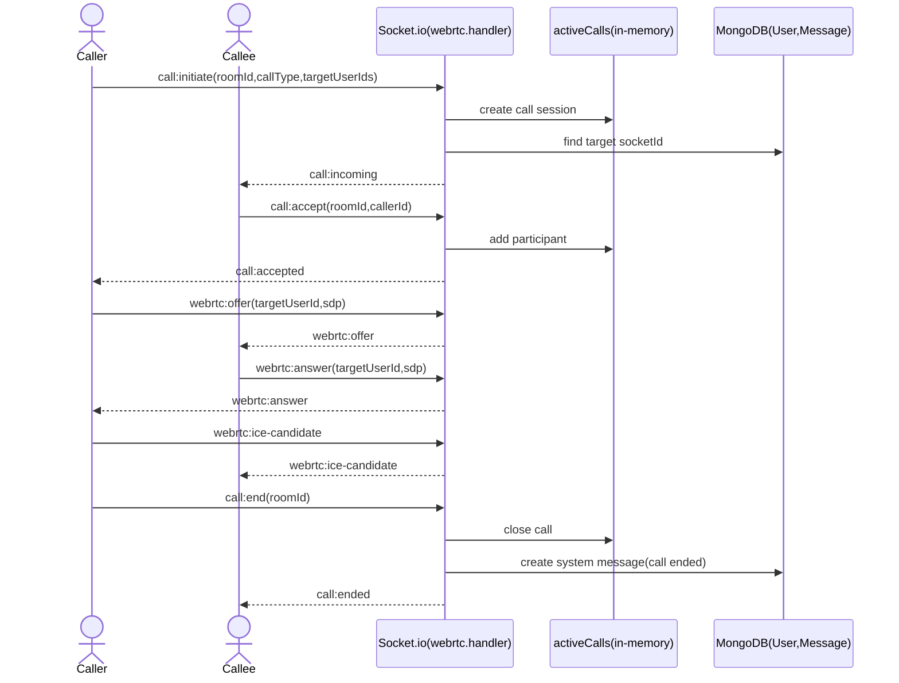

## 14. AI Assistant (tom tat, hoi dap, dich)

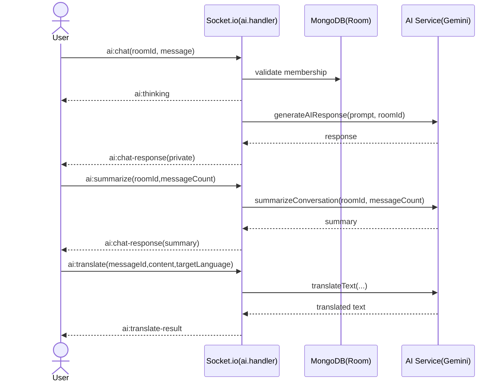

---

Neu ban muon, minh co the tach tiep theo tung endpoint chi tiet (1 endpoint = 1 sequence diagram rieng) cho tai lieu SRS/SDD.
